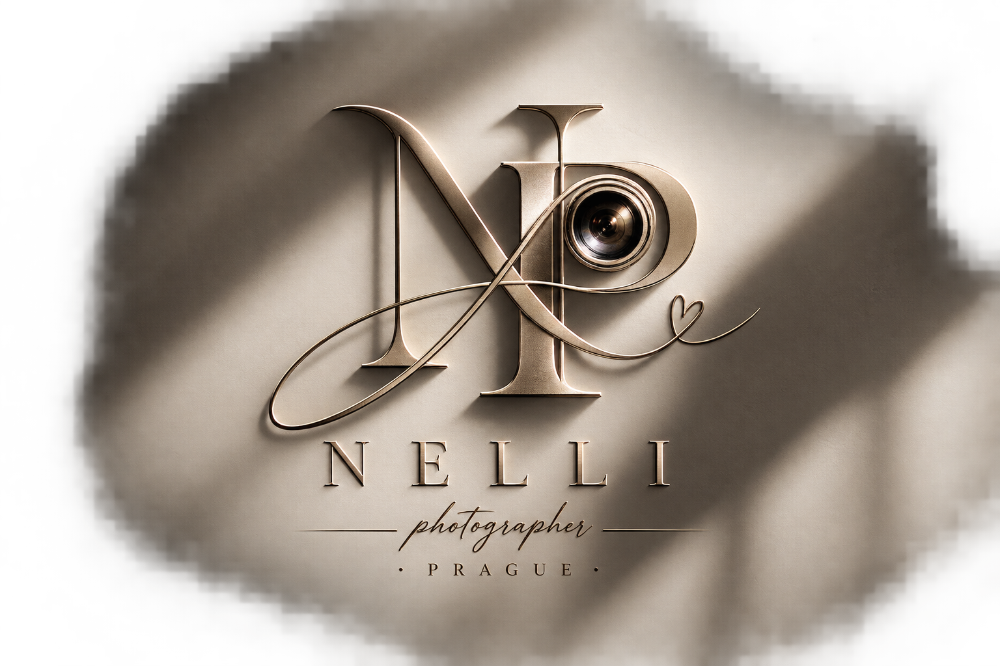

<!DOCTYPE html>
<html lang="uk">

<head>

<meta charset="UTF-8">

<meta
    name="viewport"
    content="width=device-width, initial-scale=1.0"
>

<meta
    name="description"
    content="Nelli Photography — фотограф у Празі. Весілля, хрещення, дні народження, сімейні, портретні та студійні фотосесії."
>

<title>NELLI — Photography</title>

<link rel="preconnect" href="https://fonts.googleapis.com">
<link rel="preconnect" href="https://fonts.gstatic.com" crossorigin>

<link
    href="https://fonts.googleapis.com/css2?family=Cormorant+Garamond:ital,wght@0,300;0,400;0,500;1,300;1,400&family=DM+Sans:wght@300;400;500&display=swap"
    rel="stylesheet"
>

</head>

<body>

<!-- =====================================================
     LOADER
===================================================== -->

    

        NELLI
    

    

<!-- =====================================================
     CURSOR
===================================================== -->

<!-- =====================================================
     NAVIGATION
===================================================== -->

<header class="nav" id="nav">

    <a
        href="#home"
        class="brand"
    >
        NELLI photo
    </a>

    <nav class="nav-links">

        <a href="#services"
           data-i18n="navServices">
            Зйомки
        </a>

        <a href="#portfolio"
           data-i18n="navPortfolio">
            Портфоліо
        </a>

        <a href="#about"
           data-i18n="navAbout">
            Про мене
        </a>

        <a href="#contact"
           data-i18n="navContact">
            Контакти
        </a>

    </nav>

    

        <!-- LANGUAGE -->

        

            <button
                class="language-button"
                id="languageButton"
            >

                
                    🇺🇦
                

                
                    UA
                

                ▾

            </button>

            

                <button
                    class="language-option"
                    data-lang="uk"
                >
                    🇺🇦
                    Українська
                </button>

                <button
                    class="language-option"
                    data-lang="cs"
                >
                    🇨🇿
                    Čeština
                </button>

                <button
                    class="language-option"
                    data-lang="en"
                >
                    🇬🇧
                    English
                </button>

                <button
                    class="language-option"
                    data-lang="ru"
                >
                    🇷🇺
                    Русский
                </button>

                <button
                    class="language-option"
                    data-lang="hy"
                >
                    🇦🇲
                    Հայերեն
                </button>

                <button
                    class="language-option"
                    data-lang="vi"
                >
                    🇻🇳
                    Tiếng Việt
                </button>

                <button
                    class="language-option"
                    data-lang="zh"
                >
                    🇨🇳
                    中文
                </button>

                <button
                    class="language-option"
                    data-lang="ja"
                >
                    🇯🇵
                    日本語
                </button>

            

        

        <button
            class="menu-button"
            id="menuButton"
        >
            ☰
        </button>

    

</header>

<!-- =====================================================
     MOBILE MENU
===================================================== -->

    <a
        href="#services"
        data-mobile-link
        data-i18n="navServices"
    >
        Зйомки
    </a>

    <a
        href="#portfolio"
        data-mobile-link
        data-i18n="navPortfolio"
    >
        Портфоліо
    </a>

    <a
        href="#about"
        data-mobile-link
        data-i18n="navAbout"
    >
        Про мене
    </a>

    <a
        href="#contact"
        data-mobile-link
        data-i18n="navContact"
    >
        Контакти
    </a>

<!-- =====================================================
     HERO
===================================================== -->

<section
    class="hero"
    id="home"
>

    

        <!--
            ЗАМІНИ НА СВОЄ ФОТО

            hero.jpg
        -->

        

    

    

    

    

        <!--
            ЛОГОТИП

            Залиш назву файлу,
            якщо твій логотип має
            саме таку назву.
        -->

        

            

        

        

            Фотограф у Празі
        

        <h1>

            
                Ваші моменти.
            

             

            <em data-i18n="heroTitle2">
                Моя історія в кадрі.
            </em>

        </h1>

        

            Весілля · Хрещення · Дні народження ·
            Сімейні та портретні зйомки · Студія ·
            Особливі події
        

        

            <a
                href="#services"
                class="button primary"
                data-i18n="heroButton"
            >
                Обрати зйомку
            </a>

            <a
                href="#portfolio"
                class="button secondary"
                data-i18n="heroPortfolio"
            >
                Дивитися роботи
            </a>

        

    

    

        Scroll
    

</section>

<!-- =====================================================
     INTRO
===================================================== -->

<section class="section intro reveal">

    

        

            01 — Фотографія
        

    

    

        <h2 class="section-title">

            
                Не просто
            

             

            <em data-i18n="introTitle2">
                фотографії.
            </em>

        </h2>

        

            Фотографія для мене — це спосіб
            залишити емоцію. Не постановка
            заради красивого кадру, а справжні
            моменти, до яких хочеться повертатися
            через роки.

        

        

            «Найцінніше — те, що неможливо
            повторити вдруге.»

        

    

</section>

<!-- =====================================================
     SERVICES
===================================================== -->

<section
    class="section services"
    id="services"
>

    

        

            

                02 — Зйомки
            

            <h2 class="section-title">

                
                    Ваша
                

                 

                <em data-i18n="servicesTitle2">
                    історія.
                </em>

            </h2>

        

        

            Оберіть подію або формат.
            Якщо вашого варіанту немає —
            просто напишіть мені.
            Ми придумаємо зйомку саме під вас.

        

    

    

        <!-- 01 -->

        <a
            href="#contact"
            class="service-card reveal"
        >

            
                01
            

            

                W
            

            

                <h3 data-i18n="wedding">
                    Весілля
                </h3>

                

                    Ваш день від першого
                    погляду до останнього танцю.
                

            

            
                ↗
            

        </a>

        <!-- 02 -->

        <a
            href="#contact"
            class="service-card reveal"
        >

            
                02
            

            

                C
            

            

                <h3 data-i18n="christening">
                    Хрещення
                </h3>

                

                    Один із найважливіших
                    днів вашої дитини.
                

            

            
                ↗
            

        </a>

        <!-- 03 -->

        <a
            href="#contact"
            class="service-card reveal"
        >

            
                03
            

            

                B
            

            

                <h3 data-i18n="birthday">
                    День народження
                </h3>

                

                    Свято, емоції, люди
                    та моменти, які залишаться.
                

            

            
                ↗
            

        </a>

        <!-- 04 -->

        <a
            href="#contact"
            class="service-card reveal"
        >

            
                04
            

            

                F
            

            

                <h3 data-i18n="family">
                    Сімейна
                </h3>

                

                    Теплі фотографії
                    вашої сім'ї.
                

            

            
                ↗
            

        </a>

        <!-- 05 -->

        <a
            href="#contact"
            class="service-card reveal"
        >

            
                05
            

            

                P
            

            

                <h3 data-i18n="portrait">
                    Портрет
                </h3>

                

                    Характер, стиль
                    і ваша особистість.
                

            

            
                ↗
            

        </a>

        <!-- 06 -->

        <a
            href="#contact"
            class="service-card reveal"
        >

            
                06
            

            

                S
            

            

                <h3 data-i18n="studio">
                    Студія
                </h3>

                

                    Світло, стиль
                    і контроль кожної деталі.
                

            

            
                ↗
            

        </a>

        <!-- 07 -->

        <a
            href="#contact"
            class="service-card reveal"
        >

            
                07
            

            

                M
            

            

                <h3 data-i18n="maternity">
                    Вагітність
                </h3>

                

                    Ніжна історія
                    нового життя.
                

            

            
                ↗
            

        </a>

        <!-- 08 -->

        <a
            href="#contact"
            class="service-card reveal"
        >

            
                08
            

            

                K
            

            

                <h3 data-i18n="children">
                    Дитяча
                </h3>

                

                    Справжні емоції
                    та безтурботне дитинство.
                

            

            
                ↗
            

        </a>

        <!-- 09 -->

        <a
            href="#contact"
            class="service-card reveal"
        >

            
                09
            

            

                L
            

            

                <h3>
                    Love Story
                </h3>

                

                    Ваша історія
                    про двох.
                

            

            
                ↗
            

        </a>

        <!-- 10 -->

        <a
            href="#contact"
            class="service-card reveal"
        >

            
                10
            

            

                +
            

            

                <h3 data-i18n="other">
                    Інша подія
                </h3>

                

                    Маєте іншу ідею?
                    Розкажіть мені.
                

            

            
                ↗
            

        </a>

    

</section>

<!-- =====================================================
     MARQUEE
===================================================== -->

    

        
            your story in frames
        

        <i>✦</i>

        
            moments worth keeping
        

        <i>✦</i>

        
            your story in frames
        

        <i>✦</i>

        
            moments worth keeping
        

        <i>✦</i>

        
            your story in frames
        

        <i>✦</i>

        
            moments worth keeping
        

    

<!-- =====================================================
     PORTFOLIO
===================================================== -->

<section
    class="section portfolio"
    id="portfolio"
>

    

        

            

                03 — Портфоліо
            

            <h2 class="section-title">

                
                    Кадри,
                

                 

                <em data-i18n="portfolioTitle2">
                    які залишаються.
                </em>

            </h2>

        

        

            Тут будуть ваші найкращі
            фотографії. Просто замініть
            файли photo-1.jpg, photo-2.jpg
            та інші на власні.

        

    

    

        

            

            
                Wedding
            

        

        

            

            
                Portrait
            

        

        

            

            
                Family
            

        

        

            

            
                Studio
            

        

        

            

            
                Event
            

        

    

</section>

<!-- =====================================================
     ABOUT
===================================================== -->

<section
    class="section about"
    id="about"
>

    

        

    

    

        

            04 — Про мене
        

        <h2 class="section-title">

            
                Неллі
            

             

            <em data-i18n="aboutTitle2">
                за кадром.
            </em>

        </h2>

        

            Тут буде особиста історія
            Неллі — як вона прийшла
            у фотографію, що любить
            знімати та чому обрала
            саме цей стиль.

        

        

            «Найкращі фотографії —
            це ті, де ви впізнаєте себе.»

        

    

</section>

<!-- =====================================================
     CONTACT
===================================================== -->

<section
    class="section contact"
    id="contact"
>

    

        

            05 — Запис
        

        <h2 class="section-title">

            
                Давайте
            

             

            <em data-i18n="contactTitle2">
                створимо.
            </em>

        </h2>

        

            Розкажіть про вашу подію,
            дату та бажаний формат.
            Неллі зв'яжеться з вами
            та допоможе все організувати.

        

        

            <a
                href="https://www.instagram.com/viii.hairstylist/"
                target="_blank"
                rel="noopener"
                class="contact-button"
            >
                Instagram
            </a>

            <a
                href="mailto:YOUR_EMAIL@example.com"
                class="contact-button"
            >
                Email
            </a>

            <a
                href="tel:+420000000000"
                class="contact-button"
            >
                Phone
            </a>

        

    

    

        

            <h3 data-i18n="formTitle">
                Розкажіть про зйомку
            </h3>

            <form
                action="https://formspree.io/f/xnpavyge"
                method="POST"
            >

                

                    

                        <label data-i18n="name">
                            Ваше ім'я
                        </label>

                        <input
                            type="text"
                            name="name"
                            required
                            placeholder="Ваше ім'я"
                        >

                    

                    

                        <label data-i18n="email">
                            Email
                        </label>

                        <input
                            type="email"
                            name="email"
                            required
                            placeholder="email@example.com"
                        >

                    

                    

                        <label data-i18n="phone">
                            Телефон
                        </label>

                        <input
                            type="tel"
                            name="phone"
                            placeholder="+420..."
                        >

                    

                    

                        <label data-i18n="date">
                            Дата
                        </label>

                        <input
                            type="date"
                            name="date"
                        >

                    

                    

                        <label data-i18n="type">
                            Тип зйомки
                        </label>

                        <select
                            name="session"
                            required
                        >

                            <option
                                value=""
                                data-i18n="choose"
                            >
                                Оберіть тип
                            </option>

                            <option
                                value="Wedding"
                                data-i18n="wedding"
                            >
                                Весілля
                            </option>

                            <option
                                value="Christening"
                                data-i18n="christening"
                            >
                                Хрещення
                            </option>

                            <option
                                value="Birthday"
                                data-i18n="birthday"
                            >
                                День народження
                            </option>

                            <option
                                value="Family"
                                data-i18n="family"
                            >
                                Сімейна
                            </option>

                            <option
                                value="Portrait"
                                data-i18n="portrait"
                            >
                                Портрет
                            </option>

                            <option
                                value="Studio"
                                data-i18n="studio"
                            >
                                Студія
                            </option>

                            <option
                                value="Maternity"
                                data-i18n="maternity"
                            >
                                Вагітність
                            </option>

                            <option
                                value="Children"
                                data-i18n="children"
                            >
                                Дитяча
                            </option>

                            <option
                                value="Love Story"
                            >
                                Love Story
                            </option>

                            <option
                                value="Other"
                                data-i18n="other"
                            >
                                Інша подія
                            </option>

                        </select>

                    

                    

                        <label data-i18n="message">
                            Розкажіть про вашу подію
                        </label>

                        <textarea
                            name="message"
                            placeholder="Дата, місце, кількість людей, побажання..."
                        ></textarea>

                    

                

                <input
                    type="hidden"
                    name="_subject"
                    value="Нова заявка з сайту NELLI"
                >

                <input
                    type="hidden"
                    name="language"
                    id="formLanguage"
                    value="uk"
                >

                <button
                    type="submit"
                    class="form-submit"
                    data-i18n="send"
                >
                    Надіслати заявку →
                </button>

            </form>

        

    

</section>

<!-- =====================================================
     FOOTER
===================================================== -->

<footer>

    
        © 2026 NELLI PHOTOGRAPHY
    

    
        Фотограф у Празі
    

</footer>

</body>

</html>
